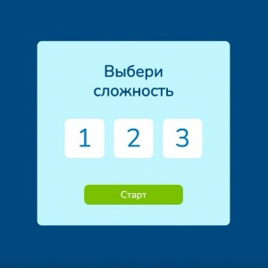

# card-game

Карточная игра. Курс инструменты разработки.



### _Описание игры_

Есть три уровня сложности: легкий, средний, сложный. От уровня сложности зависит количество карточек, которые будут показаны пользователю на игровом экране.

- Легкий уровень - 6 карточек (3 пары)
- Средний уровень - 12 карточек (6 пар)
- Сложный уровень - 18 карточек (9 пар)

Как только уровень сложности выбран, игроку показывается игровое поле на 5 секунд, после чего карточки переворачиваются рубашками вверх.


Когда пользователь кликает на карточку, она переворачивается и показывает ранг и масть.
После выбора игроком предположительной пары осуществляется сверка карточек:

- Если карточки совпадают ⇒ игра продолжается
- Если карточки не совпадают ⇒ игра заканчивается

Если были найдены все пары, игрок побеждает.


Если карточки не совпали - проигрывает.


### _Особенности реализации_

Глобальное состояние хранит всю необходимую информацию для работы игры:
- Выбранный уровень сложности.
- Статус игры (выбор сложности, игра, результат).
- Выбранные карточки.
- Время, затраченное на игру.

Для реализации глобального состояния используется глобальная переменная application:
```
window.application = {
    screens: {},
    renderScreen: function (screenName: string) {
        document.body.textContent = '';
        this.screens[`${screenName}`]();
    },
    cards: [],
    playerMoves: 3,
    time: '',
};
```
Игра реализована как SPA. Контент генерируется с помощью Javascript 2 способами:

1. Ванильный метод JavaScript
2. Шаблонизатор templateEngine()

### _Особенности проекта_

- В проект интегрирован TypeScript. Входные аргументы функций и методов объектов затипизированы.
- В проекте написаны unit-тесты. Для сверки результатов используется Jest. Запуск тестов осуществляется перед созданием коммита автоматически (с помощью husky).