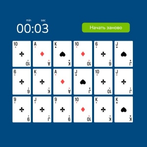
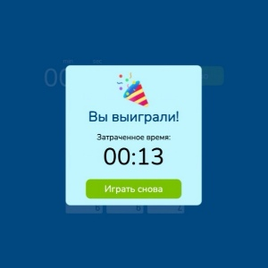

# card-game

The project on the development tools course. I am learning web development and this is my first project on github.

### _Description_

Card game contains three difficulty levels: easy, medium, and difficult. The number of cards that will be shown to the user on the game screen depends on the difficulty level.

- Easy level - 6 cards (3 pairs)
- Medium level - 12 cards (6 pairs)
- Difficult level - 18 cards (9 pairs)

As soon as the difficulty level is selected the player is shown the card field for 5 seconds after which cards are turned face down.

When the user clicks on the card it turns over.
After the player has chosen a presumptive pair cards are reconciled:

- If the cards match ⇒ the game continues
- If the cards do not match ⇒ the game ends

If all pairs have been found the player wins.

If the cards do not match the player loses.

### _Build Setup_

- install dependencies
           
      npm install

- build for production and launch server

      npm run build
      npm run start

### _Built With_

- Typescript - Programming language which is superset of JavaScript.